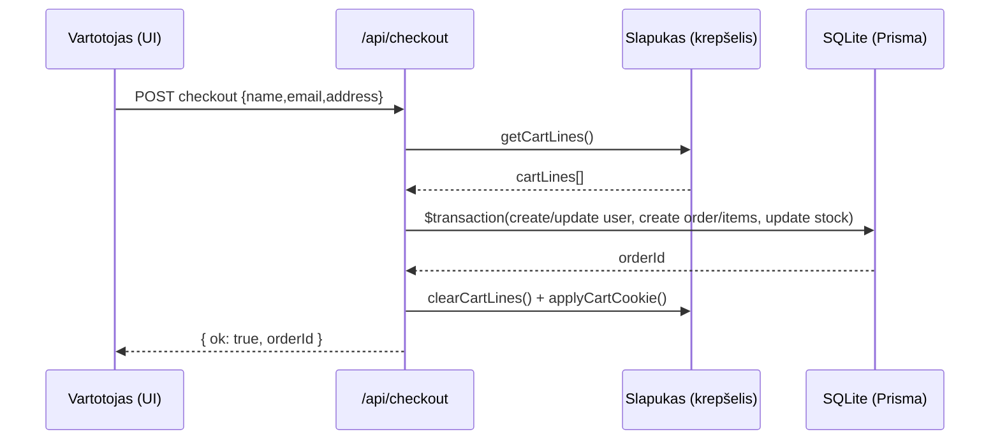
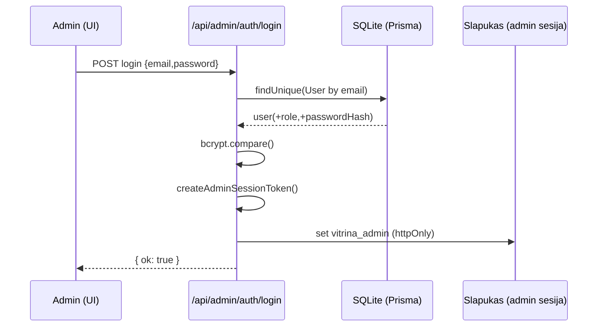

# Vitrina

Elektroninės parduotuvės projektas: **Next.js** (App Router), **React**, **Prisma** (SQLite), **Tailwind CSS**. Yra vieša parduotuvė ir **administravimo skydelis** (`/admin`).

## Reikalavimai

- [Node.js](https://nodejs.org/) 20.x ar naujesnė
- [npm](https://www.npmjs.com/) (kartu su Node)

Neprivaloma: [Docker Desktop](https://www.docker.com/products/docker-desktop/) — jei norite paleisti per „Docker Compose“.

## Greitas startas (lokaliai)

1. Nukopijuokite aplinkos kintamuosius ir nustatykite duomenų bazę:

   ```bash
   cp .env.example .env
   ```

   `.env` faile naudokite SQLite (pagal `prisma/schema.prisma`), pvz.:

   ```env
   DATABASE_URL="file:./prisma/dev.db"
   ```

2. Įdiekite priklausomybes ir paruoškite DB:

   ```bash
   npm install
   npx prisma generate
   npx prisma db push
   ```

   (Neprivaloma) pradiniai duomenys:

   ```bash
   npm run db:seed
   ```

3. Paleiskite kūrimo serverį:

   ```bash
   npm run dev
   ```

4. Naršyklėje: [http://localhost:3000](http://localhost:3000)  
   Administravimas: [http://localhost:3000/admin](http://localhost:3000/admin)

## Docker

Konteineryje naudojama ta pati SQLite schema; duomenys saugomi tomu (`/data/database.db`).

```bash
docker compose up --build
```

Arba:

```bash
npm run docker:up
```

Tada atidarykite [http://localhost:3000](http://localhost:3000).

Sustabdyti:

```bash
npm run docker:down
# arba: docker compose down
```

**Pastaba:** jei reikia pradinės duomenų užpildos, po pirmo paleidimo galite įvykdyti seed konteineryje (reikės laikinai įdiegti `tsx`), arba seed paleisti lokaliai prieš eksportą, priklausomai nuo jūsų darbo eigos.

## Naudingos komandos

| Komanda | Aprašymas |
|--------|-----------|
| `npm run dev` | Kūrimo režimas (Turbopack) |
| `npm run build` | Produkcinis build |
| `npm run start` | Produkcinis serveris (po `build`) |
| `npm run lint` | ESLint |
| `npm run db:push` | Prisma schemos sinchronizavimas su DB |
| `npm run db:generate` | Prisma kliento generavimas |
| `npm run db:seed` | Užpildymas pradiniais duomenimis |
| `npm run db:studio` | Prisma Studio (DB peržiūra) |

## Struktūra (trumpai)

- `src/app/(store)/` — parduotuvės puslapiai
- `src/app/admin/` — administravimas
- `src/app/api/` — API maršrutai
- `src/components/` — React komponentai
- `prisma/schema.prisma` — duomenų modelis

## Veikimo algoritmų modeliai (1.3)

Šiame skyriuje pateikiami du pagrindiniai sistemos procesai, aprašyti kaip veiksmų seka (modelis), kad būtų aišku, kaip UI, API, DB ir slapukai sąveikauja tarpusavyje.

### Checkout (užsakymo pateikimas)

Trumpa seka:

1. Vartotojas užpildo checkout formą (vardas, el. paštas, adresas) ir patvirtina užsakymą.
2. UI siunčia `POST` į `src/app/api/checkout/route.ts`.
3. API perskaito krepšelio eilučių duomenis iš httpOnly slapuko (`src/lib/cart/cookie.ts`).
4. Transakcijoje:
   - patikrinami produktai ir kiekiai (pagal sandėlio likutį),
   - sukuriamas (ar atnaujinamas) `User`,
   - sukuriamas `Order` ir `OrderItem`,
   - sumažinamas `Product.stock`.
5. Jei viskas sėkminga – krepšelio slapukas išvalomas ir grąžinamas `orderId`.



## Projektavimo šablonai (1.4)

Žemiau išvardinti projektavimo šablonai, kurie realiai pritaikyti programos kode (su konkrečiomis vietomis projekte).

1. **Singleton (kūrimo)** – `src/lib/prisma.ts`  
   Prisma klientas kuriamas vieną kartą ir pernaudojamas (ypač dev režime), kad nebūtų kuriami keli DB prisijungimai per hot-reload.

2. **Facade (struktūrinis)** – `src/lib/cart/cookie.ts`  
   Krepšelio slapuko (kodavimas, HMAC pasirašymas, validacija, nustatymai) detalės paslėptos už paprastų funkcijų API (`getCartLines`, `applyCartCookie`, `addToCartLines`, ir t.t.).

3. **Strategy (elgesio)** – `src/lib/slug/strategies.ts`  
   Slug generavimas realizuotas per strategijas (pvz. LT transliteracija ir Unicode normalizacija), kad skirtingose vietose būtų galima pasirinkti tinkamą elgesį.

4. **Simple Factory / Factory Method (kūrimo)** – `src/lib/slug/factory.ts`  
   Funkcija `createSlugStrategy()` / `createSlugify()` sukuria ir grąžina reikiamą slug generavimo strategiją pagal tipą (`"lt"` arba `"unicode"`), neredubliuojant logikos API failuose.

5. **Adapter (struktūrinis)** – `scripts/sources/*.ts`  
   Išoriniai produktų šaltiniai (DummyJSON ir FakeStoreAPI) apgaubti adapteriais į vienodą sąsają (`ProductSourceAdapter`), kad importo logika dirbtų su vienodu `UnifiedProduct` formatu.

### Admin prisijungimas

Trumpa seka:

1. Administratorius suveda el. paštą ir slaptažodį prisijungimo formoje.
2. UI siunčia `POST` į `src/app/api/admin/auth/login/route.ts`.
3. API:
   - patikrina įvestį,
   - suranda `User` pagal `email`,
   - patikrina, ar `role = ADMIN`,
   - palygina slaptažodį su `bcrypt`.
4. Sėkmės atveju sukuriamas pasirašytas admin sesijos tokenas (`src/lib/admin-session.ts`) ir įrašomas į httpOnly slapuką.



## Licencija ir technologijos

Projektas sukurtas naudojant [Next.js](https://nextjs.org). Šriftas: [Geist](https://vercel.com/font) per `next/font`.

Išdėstymas [Vercel](https://vercel.com) ar kitame hostinge — žr. [Next.js diegimo dokumentaciją](https://nextjs.org/docs/app/building-your-application/deploying).
